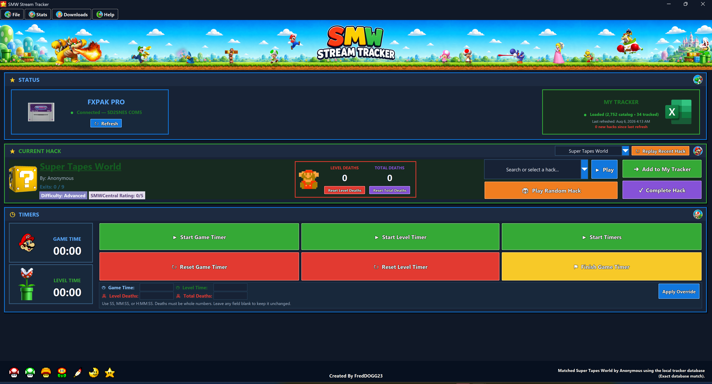
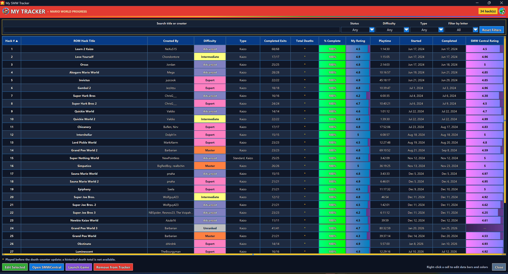
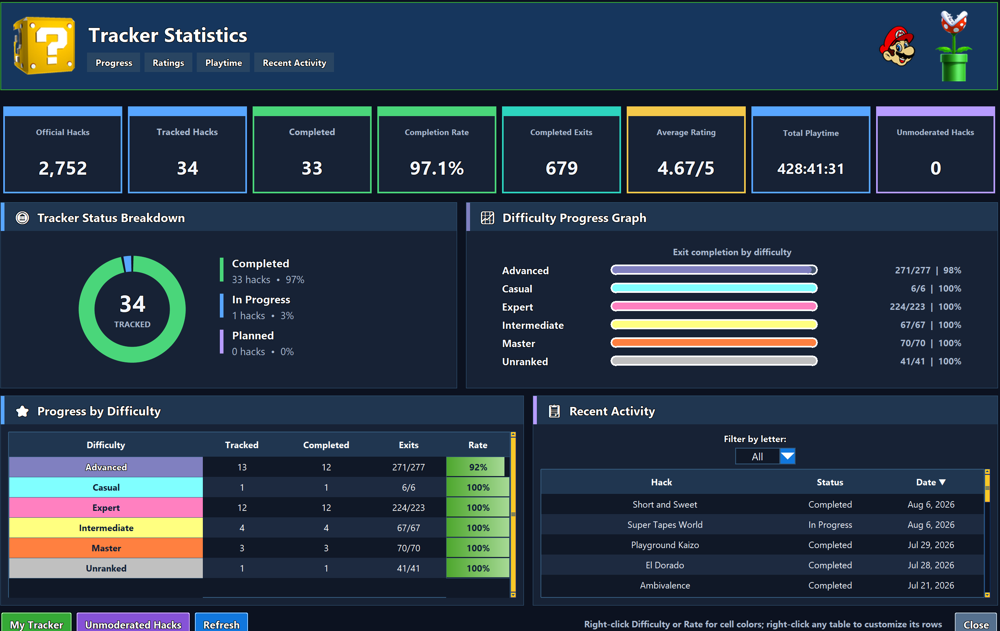
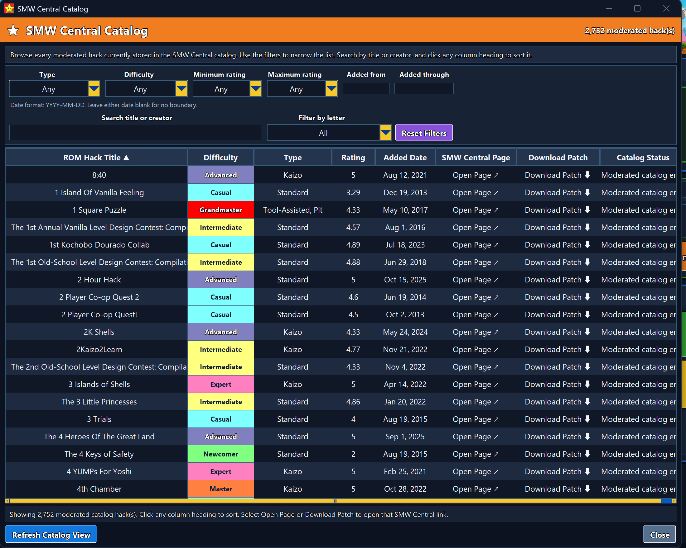

# SMW Stream Tracker

**Version 1.0.3**

SMW Stream Tracker is a Windows application for tracking Super Mario World ROM-hack progress, timers, exits, ratings, and stream text. It supports two playable platforms:

- FXPAK Pro / SD2SNES hardware
- RetroArch on Windows

The app does **not** include, download, or upload a commercial Super Mario World base ROM. To build playable ROMs from moderated patches, you must provide your own legally obtained clean base ROM.

## Screenshots

### Main dashboard

  

The v1.0.3 dashboard keeps recent hacks ready to replay and shows separate level and save-file death counters with matching OBS text output and manual overrides.

<table>
  <tr>
    <td width="50%" valign="top">
       
      <strong>My Tracker</strong> 
      Search, filter, sort, rate, launch, and manage every tracked hack, including editable total-death history.
    </td>
    <td width="50%" valign="top">
       
      <strong>Statistics</strong> 
      Review completion, playtime, ratings, difficulty progress, and recent activity.
    </td>
  </tr>
</table>

### SMW Central catalog

  

Browse the moderated catalog with title search, letter filters, difficulty and rating filters, sortable columns, SMW Central page links, and patch-download links.

## Plain-text guides in other languages

- [English](docs/README.en.txt)
- [Australian](docs/README.au.txt)
- [Español](docs/README.es.txt)
- [Français](docs/README.fr.txt)
- [Deutsch](docs/README.de.txt)
- [Português (Brasil)](docs/README.pt-BR.txt)

The setup wizard installs all six text guides in its `Documentation` folder and places the guide matching the selected installer language at the top level as `README.txt`.

## Table of contents

1. [What you need](#1-what-you-need)
2. [Install SMW Stream Tracker](#2-install-smw-stream-tracker)
3. [Choose optional software](#3-choose-optional-software)
4. [Complete the first-run health check](#4-complete-the-first-run-health-check)
5. [Set up FXPAK Pro](#5-set-up-fxpak-pro)
6. [Set up RetroArch](#6-set-up-retroarch)
7. [Configure folders and files](#7-configure-folders-and-files)
8. [Refresh and browse the SMW Central catalog](#8-refresh-and-browse-the-smw-central-catalog)
9. [Download and build moderated hacks](#9-download-and-build-moderated-hacks)
10. [Copy or upload ROMs to FXPAK Pro](#10-copy-or-upload-roms-to-fxpak-pro)
11. [Select and play a hack](#11-select-and-play-a-hack)
12. [Use timers and tracker controls](#12-use-timers-and-tracker-controls)
13. [Use My Tracker and statistics](#13-use-my-tracker-and-statistics)
14. [Set up LiveSplit, OBS Studio, and Streamlabs Desktop](#14-set-up-livesplit-obs-studio-and-streamlabs-desktop)
15. [Optional Google Sheets sync](#15-optional-google-sheets-sync)
16. [Updates, backups, and rollback](#16-updates-backups-and-rollback)
17. [Diagnostics and troubleshooting](#17-diagnostics-and-troubleshooting)
18. [Privacy and ROM notice](#18-privacy-and-rom-notice)
19. [Quick setup checklists](#19-quick-setup-checklists)

## 1. What you need

### Required for everyone

- A 64-bit Windows 10 or Windows 11 PC.
- The SMW Stream Tracker complete installer.
- A folder where your patched ROMs can be stored.
- Internet access for catalog refreshes, moderated patch downloads, updates, and optional dependency installation.

### Required for building downloaded hacks

- Your own legally obtained clean Super Mario World base ROM.
- Enough free space for the patched ROM library.

### Required for FXPAK Pro

- FXPAK Pro or compatible SD2SNES hardware.
- A USB **data** cable connected between the cartridge and PC.
- A compatible USB-enabled cartridge firmware.
- SNI or QUsb2Snes running on the PC.

### Required for RetroArch

- 64-bit RetroArch for Windows.
- A compatible SNES Libretro core, preferably bsnes-mercury Performance.
- RetroArch Network Commands enabled on port `55355`.

## 2. Install SMW Stream Tracker

1. Download `SMWStreamTracker_Setup_<version>.exe` from the official release page.
2. Verify the installer SHA-256 value against `SHA256SUMS_<version>.txt` on the same release page.
3. Open the installer. Because this release is intentionally unsigned, Windows may show **Unknown publisher** or a SmartScreen warning.
4. On **Choose Your Platform**, select either:
   - **FXPAK Pro** for cartridge hardware.
   - **RetroArch** for the Windows emulator.
5. Continue to **Optional Dependencies** and select the tools you want installed.
6. On the folder page, choose your patched-ROM library and OBS output folders, or leave them blank and configure them later.
7. Complete the wizard and launch SMW Stream Tracker.

For a first installation, always use the complete installer. Use the smaller updater only when SMW Stream Tracker is already installed.

The installer language becomes the app language. You can change it at any time
from **File → Language**; the main interface is rebuilt immediately so old
labels from the previous language do not remain on screen.

## 3. Choose optional software

The installer lets you select any combination of these tools.

### SNI — strongly recommended

Select SNI for normal live-memory tracking. The app can start the installed connection service automatically.

Official project: <https://github.com/alttpo/sni>

### QUsb2Snes — recommended for FXPAK Pro and SD2SNES

Select QUsb2Snes when you use FXPAK Pro, especially if you want to upload new ROMs through USB while the SD card remains inside the cartridge.

Official project: <https://github.com/usb2snes/usb2snes>

### RetroArch

Select RetroArch when:

- It is not already installed; and
- You plan to play through RetroArch.

You may skip it when it is already installed or when you only use FXPAK Pro. The installer can also add the bsnes-mercury Performance core when RetroArch is selected.

Official website: <https://www.retroarch.com/>

If you skip any of these tools in the installer, open **Downloads →
Connection & Emulator Setup** later. The app can locate an existing SNI,
QUsb2Snes, or RetroArch installation, or install it under the current Windows
user profile. RetroArch setup also installs the recommended SNES core, enables
Network Commands on port `55355`, and records the executable and core paths in
the app settings.

## 4. Complete the first-run health check

SMW Stream Tracker opens **Setup & Health Check** the first time version 1.0.0 or later starts.

1. Review every row.
2. A green **Ready** result needs no action.
3. A yellow **Needs Attention** result is optional or configured but not currently responding.
4. A red **Missing** result is required for the selected platform.
5. Select **Settings** to repair missing paths.
6. Select **Test Platform** to test the current platform.
7. Select **Recheck** after making changes.
8. Select **Finish Setup** when the required rows are ready.

You can reopen this page later from **File → Setup & Health Check**.

## 5. Set up FXPAK Pro

1. Insert the SD card into the FXPAK Pro.
2. Insert the cartridge into the powered-off console.
3. Connect the cartridge’s USB port to the PC with a USB data cable.
4. Power on the console.
5. Start SNI or QUsb2Snes.
6. Open SMW Stream Tracker.
7. Select **File → FXPAK Pro**.
8. Open **File → Settings**.
9. Next to **SNI / QUsb2Snes**, browse to the installed `sni.exe` or `QUsb2Snes.exe` if it was not detected automatically.
10. Save the settings.
11. In the FXPAK Pro status box, select **Refresh**.
12. Confirm the status changes to **Connected** and a device is shown.
13. Start a compatible ROM on the console and confirm **Current Hack** changes from “No game detected.”

If you installed both connection services, choose the executable you want the tracker to use. Choose QUsb2Snes when you need the app’s direct USB-upload feature.

## 6. Set up RetroArch

1. Install 64-bit RetroArch.
2. Open RetroArch.
3. Open **Online Updater → Core Downloader**.
4. Install **Nintendo - SNES / SFC (bsnes-mercury Performance)** if the installer did not already provide the core.
5. Open **Settings → Network**.
6. Turn on **Network Commands**.
7. Keep the Network Command port at `55355`.
8. Close RetroArch so the settings are saved, then open it again.
9. Open SMW Stream Tracker.
10. Select **File → RetroArch**.
11. Open **File → Settings**.
12. Set **RetroArch** to the full location of `retroarch.exe`.
13. Set **RetroArch core** to `bsnes_mercury_performance_libretro.dll` or another supported SNES core DLL.
14. Set **Local ROM library** to the folder containing your patched ROMs.
15. Save the settings.
16. Select **File → Test Selected Platform**.

When SMW Stream Tracker switches from one RetroArch game to another, it requests a save state, closes the previous content/session, and launches the selected game with the configured core.

RetroArch’s official Network Control Interface documentation confirms that Network Commands use UDP port `55355` by default: <https://docs.libretro.com/development/retroarch/network-control-interface/>

## 7. Configure folders and files

Open **File → Settings** and configure the fields you use.

| Setting | What to select |
|---|---|
| SNI / QUsb2Snes | `sni.exe` or `QUsb2Snes.exe` |
| Import workbook | Optional existing `.xlsx` or `.xlsm` tracker workbook |
| OBS text folder | Folder where current-hack and timer text files will be written |
| Local ROM library | Folder containing patched `.sfc` or `.smc` files |
| RetroArch | `retroarch.exe` |
| RetroArch core | A SNES Libretro core such as `bsnes_mercury_performance_libretro.dll` |
| Overworld timer grace | Seconds that game and active-level timers continue on the overworld before temporarily pausing |
| Game LiveSplit port | TCP port for the full-game LiveSplit window; default `16834` |
| Level LiveSplit port | TCP port for a separate level LiveSplit window; default `16835` |

Select **Save** after changing the settings.

## 8. Refresh and browse the SMW Central catalog

1. Open **Downloads → SMW Central Catalog**.
2. Select **Refresh Moderated Hacks from SMW Central**.
3. Allow the refresh to finish. The app paces requests automatically if SMW Central rate-limits them.
4. Select **View Complete Catalog**.
5. Use the filters for type, difficulty, rating, and date.
6. Select the **Added Date** heading once for newest-first and again for oldest-first.

Only moderated catalog entries are used by the downloader.

## 9. Download and build moderated hacks

1. Open **Downloads → Download Missing Hacks**.
2. Next to **Clean SMW base ROM**, select your legally obtained clean base ROM.
3. Next to **ROM game-library folder**, choose your patched-ROM library.
4. Set any optional filters:
   - Type
   - Difficulty
   - Minimum or maximum rating
   - Added-from or added-through date
5. Select **Refresh Preview**.
6. Review which entries are missing and which already exist.
7. Select **Download Moderated Hacks**.
8. Leave the window open until patching finishes.

The app downloads moderated patch ZIPs and applies them locally. It never downloads a commercial base ROM.

## 10. Copy or upload ROMs to FXPAK Pro

There are two supported methods.

### Method A: Mounted SD card

Use this when the SD card is inserted into the PC and appears as a Windows drive.

1. Open **Download Missing Hacks**.
2. Enable **Copy new ROMs to a mounted SD folder**.
3. Select the `All_Hacks` folder on the SD card.
4. Download the missing hacks.
5. The app keeps the local-library copy and adds another copy to the selected SD folder.

### Method B: USB upload without removing the SD card

Use this when the SD card remains in the FXPAK Pro.

1. Connect the FXPAK Pro to the PC with a USB data cable.
2. Power on the console.
3. Run QUsb2Snes and confirm it detects the cartridge.
4. Open **Download Missing Hacks**.
5. Enable **Upload new ROMs through FXPAK Pro USB**.
6. Leave the remote folder as `/All_Hacks`, or choose the desired folder on the card.
7. Select **Test USB**.
8. Continue only after the test succeeds.
9. Download the missing hacks.

The app uploads completed ROMs without overwriting an existing same-named card file.

## 11. Select and play a hack

1. Use **Search or select a hack** on the main page.
2. Begin typing a title or creator to filter the list.
3. Select a result.
4. Select **Play**.
5. To choose automatically, select **Play Random Hack**. Random selection uses
   only ROMs that are already downloaded and launchable on the selected
   platform; catalog-only entries are excluded.
6. Select **Add to My Tracker** to track the current hack.
7. Select **Complete Hack** after finishing it.

Clicking outside the search list collapses it. The placeholder remains until a hack is selected.

## 12. Use timers and tracker controls

- **Start Game Timer** starts or pauses the full-game timer.
- **Start Level Timer** starts or pauses the current-level timer.
- **Start Timers** controls both timers together.
- **Reset Game Timer** clears only the game timer.
- **Reset Level Timer** clears only the level timer.
- **Reset Level Deaths** clears only the current level's deaths.
- **Reset Total Deaths** clears the saved total only for the active ROM and Mario A, B, or C save file.
- **Finish Game Timer** records the final game time.
- **Apply Override** lets you enter corrected game time, level time, Level Deaths, or Total Deaths manually.

When an older hack sends Mario back to the overworld after a death, the level timer keeps counting for the configured **Overworld timer grace** period. If that period expires, it pauses and resumes when the same level is entered again. A confirmed goal tape, orb, or exit increase stops the level timer immediately; returning to the overworld then resets it to zero, and entering the next level starts a fresh timer.

Accepted timer override formats include seconds, `MM:SS`, and `H:MM:SS`. Death overrides accept whole numbers.

The tracker connection is always enabled. Use the **Refresh** button in the platform status box when you need to reconnect.

## 13. Use My Tracker and statistics

Open **Stats → My Tracker** to view and edit tracked hacks.

- Search by title or creator.
- Filter by difficulty or type.
- Click supported headings to sort.
- Right-click configurable columns to change colors, solid fills, gradients, or difficulty colors.
- Difficulty colors apply throughout the app, including the difficulty progress graph.
- Rating and completion columns use value-based data bars.

Open **Stats → Overview** for progress, ratings, playtime, recent activity, and difficulty statistics.

Use **Stats → Export My Tracker** to export as `.csv` or `.xlsx`.

## 14. Set up LiveSplit, OBS Studio, and Streamlabs Desktop

You can show the timers in either of these ways:

- **LiveSplit windows:** LiveSplit displays and styles the timers while SMW Stream Tracker controls them.
- **Text files:** OBS Studio or Streamlabs Desktop reads the timer text files written by SMW Stream Tracker. This is the simpler method and does not require LiveSplit.

You can also use both methods at the same time.

### A. Connect the full-game LiveSplit timer

1. Download and extract [LiveSplit](https://livesplit.org/downloads/). The separate, older LiveSplit Server component is not needed because current LiveSplit releases include the server.
2. Open `LiveSplit.exe`.
3. Right-click the LiveSplit window and open **Settings**.
4. Set **Server Port** to `16834`. If you will use only this one LiveSplit timer, you may set **Startup Behavior** to start the TCP server automatically. When using two LiveSplit windows, manual startup is safer because it lets you confirm each window's different port first.
5. Right-click LiveSplit and select **Control → Start TCP/WS Server**. Do this each time LiveSplit opens unless you intentionally enabled automatic startup for a single timer.
6. In SMW Stream Tracker, open **File → Settings**.
7. Set **Game LiveSplit port** to `16834`, leave the level port at `16835`, and save.
8. Select **Start Game Timer** in SMW Stream Tracker. The LiveSplit timer should start and follow the tracker controls.

LiveSplit uses its built-in TCP server for this connection. SMW Stream Tracker connects locally on `127.0.0.1`; internet or remote access is not required.

### B. Connect the separate level LiveSplit timer

Use a second LiveSplit window when you want the full-game and current-level timers visible at the same time.

1. Leave the full-game LiveSplit window open.
2. Open `LiveSplit.exe` a second time.
3. In the second window's **Settings**, set **Server Port** to `16835`.
4. Start its TCP server with **Control → Start TCP/WS Server**.
5. In SMW Stream Tracker, confirm **Level LiveSplit port** is `16835`.
6. Select **Start Level Timer** or **Start Timers**. Use **Reset Level Timer** when beginning a new level.

The two LiveSplit windows must use different ports. On later launches, verify the first window is on `16834` before starting its server, then verify the second is on `16835`. Save separate layouts such as `SMW Game Timer.lsl` and `SMW Level Timer.lsl` if you want each window to have a different size or appearance.

### C. Add the LiveSplit windows to OBS Studio

1. Keep the LiveSplit window or windows open and not minimized.
2. In OBS Studio, select the scene that should show the timers.
3. In **Sources**, select **+ → Window Capture**.
4. Name the source `Game LiveSplit`, select the full-game LiveSplit window, and confirm.
5. Move, resize, and crop the source to fit the scene.
6. Repeat with a source named `Level LiveSplit` for the second LiveSplit window.
7. Run a short test recording and operate the tracker timers to confirm both sources update.

If a LiveSplit window is blank in OBS, keep it restored instead of minimized and try another Window Capture method in the source properties.

### D. Add the LiveSplit windows to Streamlabs Desktop

1. Keep the LiveSplit window or windows open and not minimized.
2. Select the desired scene in Streamlabs Desktop.
3. In **Sources**, select **+ → Screen Capture**. In versions that list it separately, choose **Window Capture**.
4. Select the full-game LiveSplit window and name the source `Game LiveSplit`.
5. Position and resize it in the scene.
6. Repeat for the level LiveSplit window.
7. Make a short test recording before going live.

### E. Use timer text files in OBS Studio or Streamlabs Desktop

This method is recommended when you only want the timer numbers and prefer to style the font directly in the streaming program.

1. In SMW Stream Tracker, open **File → OBS Settings**.
2. Choose an **OBS text folder**, customize the author, exits, and deaths labels if desired, and save the settings.
3. The app creates all six OBS text files automatically.
4. Use **Open OBS Text Folder** in that window to open the selected folder.
5. In OBS Studio or Streamlabs Desktop, select the scene and add a **Text (GDI+)** source.
6. Enable **Read from file**.
7. Select `game_timer.txt` for the full-game timer.
8. Add a second Text source and select `level_timer.txt` for the level timer.
9. Set the font, color, outline, alignment, and size in the Text source properties.
10. Start, pause, reset, and override the timers in SMW Stream Tracker while watching the preview.

Other files in the same folder can be added the same way:

| File | Stream value |
|---|---|
| `hack_name.txt` | Current hack title |
| `author.txt` | Current creator, prefixed with `By:` |
| `exits.txt` | Completed and total exits |
| `level_deaths.txt` | Deaths in the current level; resets when a different level begins |
| `total_deaths.txt` | Saved death total for the active ROM and Mario A, B, or C save file |
| `death_counter.txt` | Compatibility mirror of `level_deaths.txt` for existing scenes |
| `game_timer.txt` | Full-game time |
| `level_timer.txt` | Current-level time |

Both counters increase once when Mario enters the death animation. Level Deaths survives ordinary retries and death-to-overworld transitions, then resets only when a genuinely different level begins or you press its reset button. Total Deaths is stored separately for each ROM and Mario A, B, or C save file and is restored when you return to that game and save file. Both labels can be edited under **File > OBS Settings**.

SMW Stream Tracker must remain running so these files continue to update. If a source shows old or blank text, verify it is reading from the same folder selected under **OBS text folder**, then operate the timer once more.

Official references: [LiveSplit server setup](https://github.com/LiveSplit/LiveSplit#the-livesplit-server), [OBS text sources](https://obsproject.com/kb/text-sources), [OBS sources guide](https://obsproject.com/kb/sources-guide), and [Streamlabs screen capture](https://streamlabs.com/content-hub/post/how-to-capture-your-screen-in-streamlabs-desktop).

## 15. Optional Google Sheets sync

1. Open the Google Sheet you want to use.
2. Select **Extensions → Apps Script**.
3. In SMW Stream Tracker, open **Stats → Google Sheets Sync**.
4. Select **Copy Script Code**.
5. Replace the Apps Script editor contents with the copied code.
6. Deploy it as a Web App.
7. Copy the deployed `/exec` URL.
8. Paste that URL into **Apps Script Web App URL** in the tracker.
9. Keep the URL private because it can update the bound sheet.
10. Select **Save & Sync Now**.

Google Sheets is optional. The local SQLite tracker database remains the primary source of truth.

## 16. Updates, backups, and rollback

### Check for an update

1. Open **File → Check for Updates**.
2. Review the version, date, size, and release notes.
3. Select **Download & Install**.
4. The app verifies the downloaded updater against the SHA-256 checksum in the official HTTPS update manifest.
5. A complete recovery backup is created before the updater starts.

### Automatic backups

The app creates one rotating recovery backup per day and keeps approximately ten. Each backup includes:

- Tracker database
- Settings
- Timer state
- ROM and platform mappings stored in those files

Use **Stats → Create Recovery Backup Now** for an immediate backup. Use **Stats → Open Automatic Backups Folder** to view them.

### Roll back the application

1. Open **File → Restore Previous App Version**.
2. Confirm the rollback.
3. The app verifies the previous executable against the SHA-256 checksum saved before the update.
4. It creates another data backup.
5. It restores and launches the previous executable.

Rollback is available only after at least one updater has preserved an earlier installed version.

## 17. Diagnostics and troubleshooting

Open **File → Diagnostics** to see the app version, selected platform, connection state, path status, backup count, and recent errors.

The copied report redacts usernames, ROM names, and full personal paths. Use:

- **Copy Diagnostics** when requesting help.
- **Open Log Folder** to view local error logs.

### FXPAK Pro shows Disconnected

1. Confirm the console is powered on.
2. Confirm the USB cable supports data, not only charging.
3. Confirm SNI or QUsb2Snes is running.
4. Confirm the correct executable is selected in **File → Settings**.
5. Confirm the connection service detects the cartridge.
6. Select **Refresh**.
7. Run **File → Test Selected Platform**.

### RetroArch launches games but shows Disconnected

1. Open RetroArch **Settings → Network**.
2. Enable **Network Commands**.
3. Confirm the port is `55355`.
4. Restart RetroArch after saving the setting.
5. Confirm `retroarch.exe` and the SNES core DLL are selected in tracker Settings.
6. If the selected connection service is SNI, use the **bsnes-mercury Performance** core. SNI does not expose a Snes9x RetroArch session as a live device.
7. If the selected connection service is QUsb2Snes, open its **Devices** menu and enable the **RetroArch virtual device**.
8. Select **File → RetroArch**.
9. Run **File → Test Selected Platform**.

### A selected ROM does not launch

1. Confirm **Local ROM library** is correct.
2. Confirm the expected `.sfc` or `.smc` file exists.
3. For RetroArch, confirm the core DLL exists.
4. For FXPAK Pro, confirm the ROM exists on the SD card or upload it first.
5. Open Diagnostics and copy the redacted error report.

### Catalog refresh is rate-limited

Leave the refresh window open. The app slows and retries its moderated catalog requests automatically. Avoid repeatedly opening additional refresh windows.

### A popup remains after the main app closes

Exit using **File → Exit** or the system-tray icon’s **Exit** command. Closing the main window normally minimizes the tracker to the tray so tracking can continue.

## 18. Privacy and ROM notice

SMW Stream Tracker does not collect telemetry and does not upload ROM files.

Network access is used only for requested or enabled features:

- SMW Central catalog and moderated patch information
- GitHub update checks and updater downloads
- Optional Google Sheets sync
- Optional dependency downloads
- Local SNI, QUsb2Snes, FXPAK Pro, and RetroArch communication

Settings, tracker data, mappings, backups, and logs remain local unless you explicitly enable Google Sheets sync or copy a diagnostic report.

See **File → About SMW Stream Tracker** for privacy, application-license, and third-party notices.

## 19. Quick setup checklists

### FXPAK Pro checklist

- [ ] Install SMW Stream Tracker.
- [ ] Install SNI or QUsb2Snes.
- [ ] Connect FXPAK Pro with a USB data cable.
- [ ] Power on the console.
- [ ] Select **File → FXPAK Pro**.
- [ ] Set the connection-service path.
- [ ] Set the local ROM library.
- [ ] Select **Refresh**.
- [ ] Run **Test Selected Platform**.
- [ ] Optionally configure mounted-SD copying or QUsb2Snes USB upload.

### RetroArch checklist

- [ ] Install SMW Stream Tracker.
- [ ] Install RetroArch and the bsnes-mercury Performance core.
- [ ] Enable Network Commands on port `55355`.
- [ ] Select **File → RetroArch**.
- [ ] Set `retroarch.exe`.
- [ ] Set the SNES core DLL.
- [ ] Set the local ROM library.
- [ ] Run **Test Selected Platform**.
- [ ] Select a hack and choose **Play**.

### Help checklist

- [ ] Open **File → Setup & Health Check**.
- [ ] Repair red or yellow items that apply to your selected platform.
- [ ] Open **File → Diagnostics**.
- [ ] Select **Copy Diagnostics**.
- [ ] Include the redacted report when requesting support.
