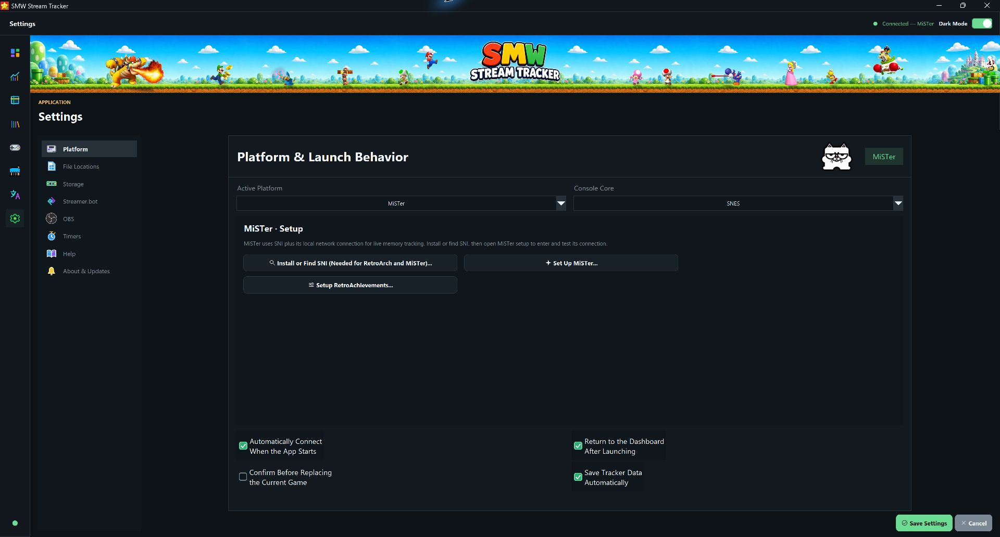
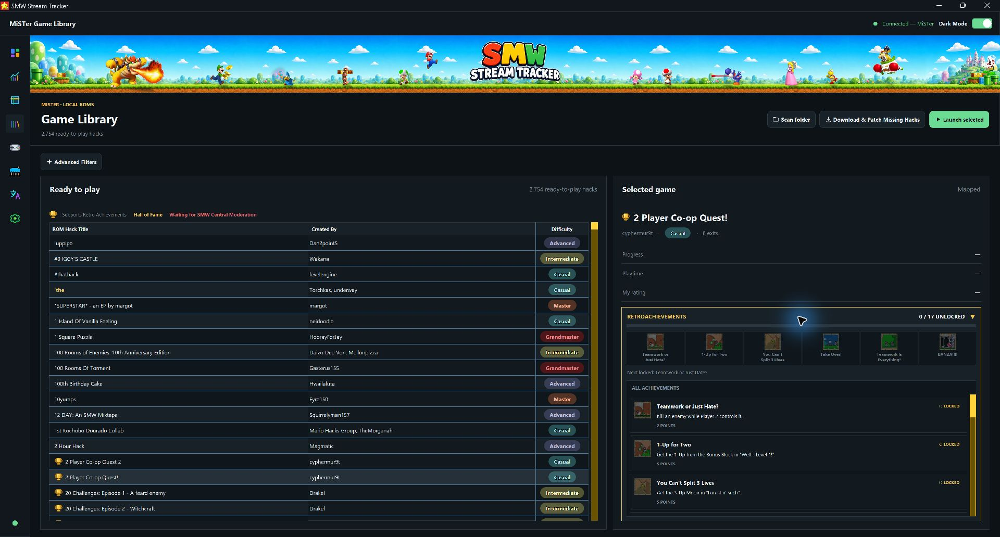
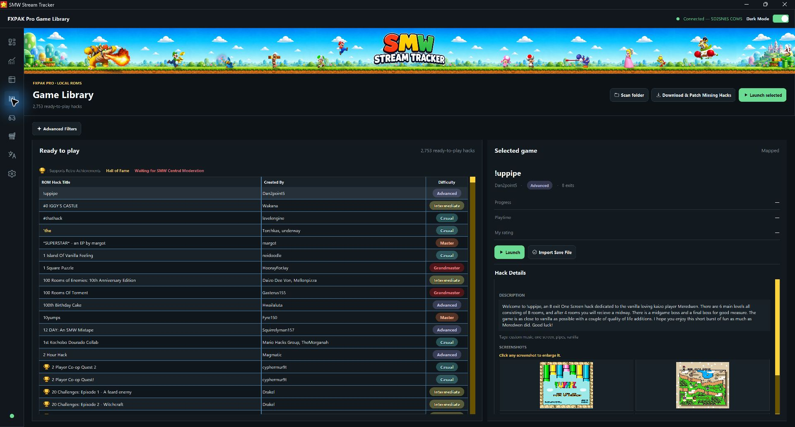
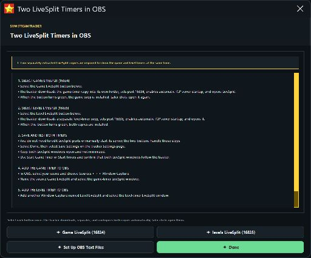
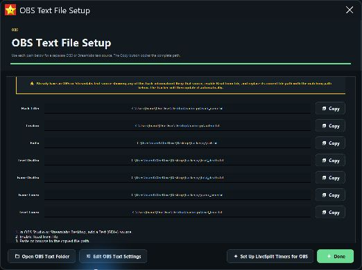
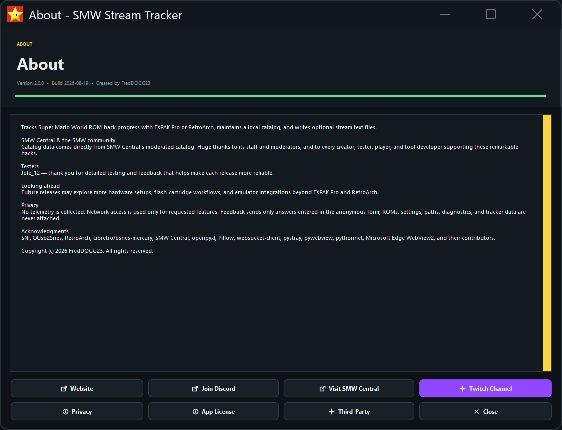

# SMW Stream Tracker

**Version 2.2.0**

SMW Stream Tracker is a Windows application for tracking Super Mario World ROM-hack progress, timers, exits, ratings, and stream text. It supports three playable platforms:

- FXPAK Pro / SD2SNES hardware
- RetroArch on Windows
- MiSTer FPGA over the local network

The app does **not** include, download, or upload a commercial Super Mario World base ROM. To build playable ROMs from moderated patches, you must provide your own legally obtained clean base ROM.

## What’s new in v2.2.0

- Adds **Music Identifier & Radio** with private local SMW Central audio
  matching. It can listen through a capture card, microphone, or Windows
  system-audio source, returns confident matches early, stops immediately when
  cancelled, and checks for new or changed music every 30 minutes while open.
- Adds a polished in-app **SPC Player** with play/pause, replay, highlighted
  looping, next track, progress seeking, volume, collapse, scrolling track
  text, anti-aliased controls, and smoother dragging.
- Adds an **SMW Central Radio OBS Browser Source** controlled by the in-app SPC
  player, with live title, artist, time, equalizer, and progress information.
- Adds one-click Streamer.bot setup for a configurable **What Song Is Playing?**
  channel-point reward. The reward can be restricted to a chosen OBS scene and
  posts the current level's song title and SMW Central listening link to chat.
- Adds reward cost and cooldown controls, an in-app Streamer.bot installer, and
  compatibility with existing rewards and current Streamer.bot navigation.
- Caches live ROM, level, room, and music state for fast repeat redemptions while
  ensuring a changed level or song receives a fresh result.
- Improves normal shutdown and tracker recovery so closing the app intentionally
  does not cause a false crash-recovery warning.

This is a Windows-only release. No macOS artifacts are published because the
macOS build has not been tested.

## What’s new in v2.1.0

- Adds a dedicated **SNES ROMs** tab to Game Library with cleaned display
  names, folder-wide importing, matching search and filters, bulk selection and
  deletion, centered columns, and the existing MiSTer SD-card workflow.
- Extends **RetroAchievements** identification to imported SNES games, with
  trophy markers and the same expandable official badge, requirement, point,
  and unlock details used by SMW hacks.
- Adds dated “new since refresh” tracking for moderated and waiting SMW Central
  hacks, with notification dots on Game Library and the matching refresh and
  download actions.
- Adds multiple named MiSTer profiles, automatic online-console failover, and
  automatic Ethernet/Wi-Fi address discovery while retaining manual controls.
- Speeds up bulk MiSTer ROM transfers with verified on-device hashing and
  atomic uploads, and makes **Find & Set Up MiSTer** install virtual save-state
  slots 5–11 automatically.
- Expands Streamer.bot from outbound events to approved tracker controls,
  prevents action feedback loops, and adds suggested one-click action mapping.
- Adds tracker automation for adaptive polling, crash recovery, automatic
  backups, library maintenance, post-stream summaries, completion detection,
  and automatic statistic reconciliation.
- Adds **Always Ask to Confirm Final Exit** under Platform settings and only
  suggests completion when the final exit and completion state agree.
- Automatically hides SMW-only creator and exit information for ordinary SNES
  games while keeping hack/game name, deaths, and level/game timers available.
- Rejects suspicious death samples during pipes, doors, level transitions,
  loading screens, and save-state restoration, including RA-SNES/SNI sessions.
- Compacts the MiSTer and RetroArch platform pages into single-page layouts,
  modernizes remaining setup/detail dialogs, and keeps Tracker Automation under
  Platform settings.

This is a Windows-only release. No macOS artifacts are published because the
macOS build has not been tested.

## What’s new in v2.0.3

- Fixes the icon-only main sidebar hover labels so they reliably appear beside
  the pointer inside the tracker window. Settings entries keep their existing
  visible text without redundant tooltips.

- Adds a direct **Streamer.bot WebSocket integration** with its own Settings
  page above OBS. Users can connect to their local Streamer.bot server, load
  enabled actions, and independently map confirmed game, death, exit, level,
  timer, completion, connection, and RetroAchievements events.
- Gives every Settings section its requested color icon: a Super Nintendo
  console for Platform, Windows file, NVMe drive, Streamer.bot links, OBS
  logo, stopwatch, open book, and notification bell.
- Adds full-color artwork to the main navigation, uses the colored Super
  Famicom controller for Game Modes, and uses the supplied SMW Central
  pixel-art logo for its catalog button.
- Stabilizes RA-SNES/SNI memory readings before they reach the dashboard so a
  temporary bad sample cannot add a random death, flash exits to zero, restore
  another Mario slot's timers, or move the session timeline back and forth.
- Prevents horizontal pipes, vertical pipes, and doors—including same-room
  transitions—from being interpreted as retry-only deaths in the RA core.
- Makes the live death counter respond immediately after a confirmed death by
  notifying the app and WebSocket dock before slower progress and OBS-file
  persistence work.
- Keeps the dashboard exit denominator numeric by carrying the selected
  library game's known total into live tracking, even when an RA-compatible
  core or MiSTer reports a shortened or platform-specific ROM path.
- Uses MiSTer's supported centered, single-line RetroAchievements popup layout
  to keep achievement notifications inside the visible 4:3 SNES HDMI area.
- Hides MiSTer's persistent RetroAchievements leaderboard tracker during a
  level while preserving the submitted-score popup at the end of the attempt.
- Existing MiSTer users can rerun RetroAchievements Setup once to apply the
  HDMI-safe popup settings without changing their account or progress.

This is a Windows-only release. No macOS artifacts are published because the
macOS build has not been tested.

## What’s new in v2.0.2

- Adds an authenticated **OBS companion dock** that communicates directly
  with the running tracker over a local WebSocket and receives its own unique,
  persistent dock URL on every Windows installation.
- Lets users choose which dock cards are visible and optionally enable
  **Search & Play** and **Play Random Hack**, with the tracker’s rating,
  difficulty, type, release, and Hall of Fame filters built into Configure.
- Repairs **Download and Install**, restores the Settings update badge, and
  makes the first-install desktop-shortcut option create the shortcut reliably.
- Packages complete MiSTer SSH support in the Windows EXE and prevents missing
  Paramiko dependencies from producing broken setup dialogs or releases.
- Removes the unstable experimental MiSTer Main from automatic setup and the
  Windows package, blocks launches through that known-bad build, and preserves
  the verified **Restore Previous MiSTer Version** recovery path.
- Keeps the Overview stable and better filled, while preserving the fitted
  Stream Desk setup and OBS pages delivered in v2.0.1.

This is a Windows-only release. No macOS artifacts are published because the
macOS build has not been tested.

## What’s new in v2.0.1

- Adds live **RetroAchievements** progress, recent unlocks, and official badge
  artwork to the Overview and every recognized selected game, plus an editable
  `achievements.txt` source for OBS and Streamlabs.
- Repairs incomplete Game Library caches automatically and finishes a complete
  background scan so the full local library reliably appears.
- Gives MiSTer, RetroAchievements, OBS Text File Setup, and OBS Text Settings
  the Stream Desk interface, with larger actions and properly fitted content.
- Keeps every Overview card visible without scrolling and removes the resize
  feedback loop that could make the page twitch at compact window sizes.
- Improves dashboard game shortcuts, MiSTer death handling and save imports,
  and adds one linked thank-you message for the community testers.
- Prevents duplicate or clipped native controls on the installer and updater
  finish pages while preserving the themed launch options.

## What’s new in v2.0.0

- Completes the **Stream Desk** redesign across the dashboard, tracker,
  library, settings, game modes, setup tools, popups, and Windows installer,
  with responsive layouts and consistent dark and light themes.
- Adds and expands game modes, including **Hot Potato** and the **Mario Kaizo
  Challenge**, with curated playlists, automatic next-hack selection,
  dashboard controls, and challenge-wide exit tracking.
- Adds guided **RetroAchievements** setup for RetroArch, MiSTer, and FXPAK Pro,
  exact-ROM trophy markers, compatible-core launch routing, and shared filters.
- Unifies advanced search and filtering by title, creator, difficulty, type,
  release status, Hall of Fame, moderation status, and RetroAchievements across
  the library, tracker, downloader, playlists, and random game selection.
- Makes the app smoother and faster with background catalog work, instant
  downloader opening, cached lookups, stable page sizing, and safer widget
  refreshes that no longer flash legacy colors.
- Normalizes every RetroArch launch to prevent accidental fast-forward and FPS
  overlays, and improves MiSTer, FXPAK Pro, death detection, timer, and game
  transition reliability.
- Refreshes the installer and updater, accelerates optional QUsb2Snes and
  RetroArch setup, preserves user ROMs and tools during uninstall, and gives
  every shipped translation the same complete interface coverage.

## What’s new in v1.1.2

- Prevents a delayed outlined-button redraw from reporting a Tkinter
  `invalid command name` error after its popup has already closed.
- Adds regression coverage for both already-destroyed buttons and the narrow
  timing race where a button disappears immediately after the existence check.
- This cleanup-only fix does not change MiSTer, FXPAK Pro, RetroArch, tracker
  data, or any translated interface text.

## What’s new in v1.1.1

- Adds an integrated **SMW Central** home experience with live content cards,
  richer hack details, tag search, screenshots, and account/comment tools.
- Adds **SMW Central Radio** and SPC playback, including a compact player that
  can be moved, resized, minimized, and kept open while using the tracker.
- Adds optional **OBS Capture Mode**, which keeps the tracker's blue popups
  inside the main window so one OBS Window Capture source can include them.
- Adds MiSTer save states **5–11** to the normal Windows build. Installation is
  compatibility-checked, preserves an exact restorable backup, keeps native
  slots 1–4 intact, and leaves F12 assigned to the MiSTer menu.
- Reorganizes Setup, application, OBS, and LiveSplit menus while preserving the
  guided setup flow, and returns to the dashboard after a Game Mode launches.
- Fixes stale MiSTer connection data affecting RetroArch, several window and
  resizing edge cases, and the Google Sheets settings close flow.
- Completes all new interface text in English, Australian, Spanish, French,
  German, and Brazilian Portuguese, with a permanent deep translation audit.

## What’s new in v1.1.0

- Adds full **MiSTer FPGA** support with one-click network discovery and setup,
  ROM upload and launch, live tracking, controller restoration after switching
  games, and compatibility with standard MiSTer and MiSTer Multisystem² setups.
- Adds **Game Modes** with Play Random Hack, Hack Draft, Difficulty Vine,
  Creator Spotlight, Time Capsule, and Hall of Fame Tour. Each mode has a
  translated blue window and a description shown when its button is hovered.
- Adds smart Excel import, Google Sheets synchronization, Spreadsheet Settings,
  and automatic tracker/database recovery backups created on every clean exit.
- Reworks My Tracker with compact add/remove controls, multi-row removal,
  automatic Hack # renumbering, and cleaner spreadsheet and Google Sheets menus.
- Hides platform-specific setup and settings that do not apply to the selected
  FXPAK Pro, RetroArch, or MiSTer platform.
- Speeds up the optional Windows RetroArch setup and waits to open RetroArch
  until a game is actually launched.
- Adds Streamer.bot level-event output and translated setup guides for optional
  Twitch prediction automation.
- Keeps the complete emoji-safe FXPAK mapping, guided setup, OBS/LiveSplit
  tools, catalog, and blue dialog system.
- Completes every new menu, button, status, popup, and setup instruction in all
  six languages, including the playful Australian translation.
- **About** includes a translated **Join Discord** button for help and
  contact: <https://discord.gg/fHkTRgqjcr>

## Screenshots

### Main dashboard

  

The current Stream Desk dashboard keeps the active hack, session timeline,
death and exit counters, finish controls, and upcoming playlist together in one
responsive view.

### Settings

  

Settings groups platform, file, storage, Streamer.bot, OBS, timer, help, and
update controls into one labeled menu with dedicated color symbols.

### RetroAchievements

  

Select the RetroAchievements card in Game Library to expand every badge,
requirement, point value, and locked or unlocked state for that game.

<table>
  <tr>
    <td width="50%" valign="top">
       
      <strong>My Tracker</strong> 
      Search, filter, sort, rate, launch, and manage every tracked hack, including editable total-death history.
    </td>
    <td width="50%" valign="top">
       
      <strong>Overview</strong> 
      Review completion, playtime, ratings, difficulty progress, and recent activity.
    </td>
  </tr>
</table>

### Game library

  

Search and filter ready-to-play ROMs, launch a selected hack, open its details
and screenshots, import a save file, or download and patch anything missing.
Gold trophies identify RetroAchievements-supported releases.

### SMW Central hub

  

Open SMW Central updates and radio, sign in through SMW Central, or visit the
site directly without leaving the Stream Desk navigation.

<table>
  <tr>
    <td width="50%" valign="top">
       
      <strong>Two LiveSplit timers</strong> 
      Download and configure separate game and level timers with the correct ports and automatic TCP server startup.
    </td>
    <td width="50%" valign="top">
       
      <strong>OBS text files</strong> 
      Copy the live text-file paths or replace an existing OBS or Streamlabs text source so it updates automatically.
    </td>
  </tr>
  <tr>
    <td colspan="2" valign="top">
       
      <strong>Help and contact</strong> 
      Open the Discord community directly from the translated About page.
    </td>
  </tr>
</table>

## Plain-text guides in other languages

- [English](docs/README.en.txt)
- [Australian](docs/README.au.txt)
- [Español](docs/README.es.txt)
- [Français](docs/README.fr.txt)
- [Deutsch](docs/README.de.txt)
- [Português (Brasil)](docs/README.pt-BR.txt)

The setup wizard installs all six text guides in its `Documentation` folder and places the guide matching the selected installer language at the top level as `README.txt`.

## Table of contents

1. [What you need](#1-what-you-need)
2. [Install SMW Stream Tracker](#2-install-smw-stream-tracker)
3. [Choose optional software](#3-choose-optional-software)
4. [Complete the first-run health check](#4-complete-the-first-run-health-check)
5. [Set up FXPAK Pro](#5-set-up-fxpak-pro)
6. [Set up RetroArch](#6-set-up-retroarch)
7. [Configure folders and files](#7-configure-folders-and-files)
8. [Refresh and browse the SMW Central catalog](#8-refresh-and-browse-the-smw-central-catalog)
9. [Download and build moderated hacks](#9-download-and-build-moderated-hacks)
10. [Copy or upload ROMs to FXPAK Pro](#10-copy-or-upload-roms-to-fxpak-pro)
11. [Select and play a hack](#11-select-and-play-a-hack)
12. [Use timers and tracker controls](#12-use-timers-and-tracker-controls)
13. [Use My Tracker and statistics](#13-use-my-tracker-and-statistics)
14. [Set up LiveSplit, OBS Studio, and Streamlabs Desktop](#14-set-up-livesplit-obs-studio-and-streamlabs-desktop)
15. [Optional Google Sheets sync](#15-optional-google-sheets-sync)
16. [Updates, backups, and rollback](#16-updates-backups-and-rollback)
17. [Diagnostics and troubleshooting](#17-diagnostics-and-troubleshooting)
18. [Privacy and ROM notice](#18-privacy-and-rom-notice)
19. [Quick setup checklists](#19-quick-setup-checklists)

## 1. What you need

### Required for everyone

- A 64-bit Windows 10/11 PC.
- The Windows complete installer.
- A folder where your patched ROMs can be stored.
- Internet access for catalog refreshes, moderated patch downloads, updates, and optional dependency installation.

### Required for building downloaded hacks

- Your own legally obtained clean Super Mario World base ROM.
- Enough free space for the patched ROM library.

### Required for FXPAK Pro

- FXPAK Pro or compatible SD2SNES hardware.
- A USB **data** cable connected between the cartridge and computer.
- A compatible USB-enabled cartridge firmware.
- SNI or QUsb2Snes running on the PC.

### Required for RetroArch

- 64-bit RetroArch for Windows.
- A compatible SNES Libretro core, preferably bsnes-mercury Performance.
- RetroArch Network Commands enabled on port `55355`.

### Required for MiSTer

- A MiSTer connected to the same local network by Ethernet or Wi-Fi.
- The current MiSTer Main and SNES core.
- SSH access. The factory login is `root` with password `1`; the tracker also
  supports an SSH key and never saves the entered password.
- A configured local patched-ROM library in SMW Stream Tracker.

## 2. Install SMW Stream Tracker

### Windows

1. Download `SMWStreamTracker_Setup_<version>.exe` from the official release page.
2. Verify the installer SHA-256 value against `SHA256SUMS_<version>.txt` on the same release page.
3. Open the installer. Because this release is intentionally unsigned, Windows may show **Unknown publisher** or a SmartScreen warning.
4. On **Choose Your Platform**, select either:
   - **FXPAK Pro** for cartridge hardware.
   - **RetroArch** for the Windows emulator.
5. Continue to **Optional Dependencies** and select the tools you want installed.
6. On the folder page, choose your patched-ROM library and OBS output folders, or leave them blank and configure them later.
7. Complete the wizard and launch SMW Stream Tracker.

For a first installation, always use the complete installer. Use the smaller updater only when SMW Stream Tracker is already installed.

### Windows reinstall and uninstall behavior

A full uninstall removes the tracker program, settings, database, backups,
logs, updates, LiveSplit copies, and tracker-created OBS text files. It keeps
RetroArch, SNI, QUsb2Snes, and every ROM file or ROM-library folder. A later
fresh installation shows the branded welcome and setup splash again.

The complete installer allows only one installed copy for the current Windows
account. Running it again asks whether to remove the current copy and continue
with a fresh installation, or completely uninstall the tracker and exit Setup.
Both choices preserve RetroArch, SNI, QUsb2Snes, and all ROM files.

The installer language becomes the app language. You can change it at any time
from **File → Language**; the main interface is rebuilt immediately so old
labels from the previous language do not remain on screen.

## 3. Choose optional software

The installer lets you select any combination of these tools.

When the app finds an existing SNI, QUsb2Snes, or RetroArch installation, its
localized blue confirmation box lets you use that copy automatically or choose
a fresh download instead.

### SNI — needed for RetroArch

RetroArch users need both RetroArch and SNI for live-memory tracking. The app can start the installed SNI connection service automatically.

During the flashing setup guide, completing QUsb2Snes advances directly to the
catalog step. If SNI or RetroArch is selected, the guide stays on the connection
step until both SNI and RetroArch have each been completed.

Official project: <https://github.com/alttpo/sni>

### QUsb2Snes — needed for FXPAK Pro and SD2SNES

FXPAK Pro and SD2SNES users need QUsb2Snes. SNI is not required for the FXPAK Pro workflow.

Official project: <https://github.com/usb2snes/usb2snes>

### RetroArch

Select RetroArch when:

- It is not already installed; and
- You plan to play through RetroArch.

You may skip it when it is already installed or when you only use FXPAK Pro. When RetroArch is selected, the blue SMW Stream Tracker installer downloads and extracts the official portable build into its Tools folder, adds the bsnes-mercury Performance core, enables Network Commands on port `55355`, and saves the correct executable and core paths. No separate RetroArch setup wizard opens.

Official website: <https://www.retroarch.com/>

### MiSTer

During a fresh Windows installation, choose **MiSTer FPGA** and leave **Set up
MiSTer on first launch** selected. The flashing setup guide will lead directly
to the same one-click setup below.

1. Connect MiSTer and this computer to the same router and power on MiSTer.
2. In the app, open **Downloads → Connection & Emulator Setup → Set Up
   MiSTer**.
3. Select **Find & Set Up MiSTer**. The app locates and verifies the MiSTer,
   downloads the pinned `snid` release, verifies its SHA-256 checksum, repairs
   the required services, enables SNI mode, creates the tracker ROM and launch
   folders, selects MiSTer, and tests the finished connection.
4. The app creates its own SSH key for later automatic connections. It never
   saves the entered SSH password. If the automatic search needs a password,
   the factory login is user `root`, port `22`, password `1`.
5. Load the SNES core once and select **Refresh** in the tracker. Live timers,
   deaths, exits, checkpoints, and current-game detection then use MiSTer's
   memory bridge directly.
6. Launch any locally patched hack from the tracker. The app gives the MiSTer
   copy a hardware-safe filename, uploads it by SFTP when needed, writes an MGL
   launch file, and switches MiSTer directly into that game. The catalog title
   and SMW Central identity remain unchanged inside the tracker.

The app does not store an SSH password or expose MiSTer to the internet. The
app-only SSH key is stored in the current user's application-data folder. Its
MiSTer setup, upload, launch, and live-tracking traffic stays on the local
network. The MiSTer-side helper comes from
<https://github.com/NobodyNada/snid>; MiSTer SNES core and network information
is available from <https://mister-devel.github.io/MkDocs_MiSTer/>.

The normal Windows build includes MiSTer save states 5–11 automatically whenever
**Find & Set Up MiSTer** or **Install Virtual Save State Slots** is run. Use `Alt+F5`
through `Alt+F11` to save and `F5` through `F11` to load states 5–11. `F12`
still opens the MiSTer menu, and native
slots 1–4 remain intact. Tracker updates keep this feature packaged and may safely update a
version that the tracker previously installed. If MiSTer Main is updated
independently, the tracker detects the changed file and refuses to overwrite or
downgrade it. Use **Restore Previous MiSTer Version** before updating MiSTer
Main, then install a tracker build made for that newer Main version.

If you skip any of these tools in the installer, open **Downloads →
Connection & Emulator Setup** later. The app can locate an existing SNI,
QUsb2Snes, or RetroArch installation, or install it under the current user
profile on Windows. RetroArch setup also installs the recommended SNES core, enables
Network Commands on port `55355`, and records the executable and core paths in
the app settings.

## 4. Complete the first-run health check

SMW Stream Tracker opens **Setup & Health Check** the first time version 1.0.0 or later starts.

1. Review every row.
2. A green **Ready** result needs no action.
3. A yellow **Needs Attention** result is optional or configured but not currently responding.
4. A red **Missing** result is required for the selected platform.
5. Select **Settings** to repair missing paths.
6. Select **Test Platform** to test the current platform.
7. Select **Recheck** after making changes.
8. Select **Finish Setup** when the required rows are ready.

You can reopen this page later from **File → Setup & Health Check**.

## 5. Set up FXPAK Pro

1. Insert the SD card into the FXPAK Pro.
2. Insert the cartridge into the powered-off console.
3. Connect the cartridge’s USB port to the PC with a USB data cable.
4. Power on the console.
5. Start SNI or QUsb2Snes.
6. Open SMW Stream Tracker.
7. Select **File → FXPAK Pro**.
8. Open **File → Settings**.
9. Next to **SNI / QUsb2Snes**, browse to the installed Windows executable if it was not detected automatically.
10. Save the settings.
11. In the FXPAK Pro status box, select **Refresh**.
12. Confirm the status changes to **Connected** and a device is shown.
13. Start a compatible ROM on the console and confirm **Current Hack** changes from “No game detected.”

If you installed both connection services, choose the executable you want the tracker to use. Choose QUsb2Snes when you need the app’s direct USB-upload feature.

## 6. Set up RetroArch

1. Install 64-bit RetroArch.
2. Open RetroArch.
3. Open **Online Updater → Core Downloader**.
4. Install **Nintendo - SNES / SFC (bsnes-mercury Performance)** if the installer did not already provide the core.
5. Open **Settings → Network**.
6. Turn on **Network Commands**.
7. Keep the Network Command port at `55355`.
8. Close RetroArch so the settings are saved, then open it again.
9. Open SMW Stream Tracker.
10. Select **File → RetroArch**.
11. Open **File → Settings**.
12. Set **RetroArch** to the full location of `retroarch.exe`.
13. Set **RetroArch core** to `bsnes_mercury_performance_libretro.dll` or another supported Windows SNES core.
14. Set **Local ROM library** to the folder containing your patched ROMs.
15. Save the settings.
16. Select **File → Test Selected Platform**.

When SMW Stream Tracker switches from one RetroArch game to another, it requests a save state, closes the previous content/session, and launches the selected game with the configured core.

RetroArch’s official Network Control Interface documentation confirms that Network Commands use UDP port `55355` by default: <https://docs.libretro.com/development/retroarch/network-control-interface/>

## 7. Configure folders and files

Open **File → Settings** and configure the fields you use.

| Setting | What to select |
|---|---|
| SNI / QUsb2Snes | The SNI or QUsb2Snes Windows executable |
| Import workbook | Optional existing `.xlsx` or `.xlsm` tracker workbook |
| OBS text folder | Folder where current-hack and timer text files will be written |
| Local ROM library | Folder containing patched `.sfc` or `.smc` files |
| RetroArch | The Windows `retroarch.exe` executable |
| RetroArch core | A Windows SNES Libretro core such as `bsnes_mercury_performance_libretro.dll` |
| Overworld timer grace | Seconds that game and active-level timers continue on the overworld before temporarily pausing |
| Game LiveSplit port | TCP port for the full-game LiveSplit window; default `16834` |
| Level LiveSplit port | TCP port for a separate level LiveSplit window; default `16835` |

Select **Save** after changing the settings.

## 8. Refresh and browse the SMW Central catalog

1. Open **Downloads → SMW Central Catalog**.
2. Select **Refresh Moderated Hacks from SMW Central**.
3. Allow the refresh to finish. The app paces requests automatically if SMW Central rate-limits them.
4. Select **View Complete Catalog**.
5. Use the filters for type, difficulty, rating, and date.
6. Select the **Added Date** heading once for newest-first and again for oldest-first.

Only moderated catalog entries are used by the downloader.

Use **Reset Catalog** at the bottom of the SMW Central Catalog to remove every
locally stored moderated and waiting entry. The app creates a recovery backup
first and preserves My Tracker progress, ratings, notes, custom hacks, ROM
mappings, and ROM files. Refresh the moderated catalog whenever you want it
back.

## 9. Download and build moderated hacks

1. Open **Downloads → Download Missing Hacks**.
2. Next to **Clean SMW base ROM**, select your legally obtained clean base ROM.
3. Next to **ROM game-library folder**, choose your patched-ROM library.
4. Set any optional filters:
   - Type
   - Difficulty
   - Minimum or maximum rating
   - Added-from or added-through date
5. Select **Refresh Preview**.
6. Review which entries are missing and which already exist.
7. Select **Download Moderated Hacks**.
8. Leave the window open until patching finishes.

The app downloads moderated patch ZIPs and applies them locally. It never downloads a commercial base ROM.

## 10. Copy or upload ROMs to FXPAK Pro

There are two supported methods.

### Method A: Mounted SD card

Use this when the SD card is inserted into the computer and appears as a Windows drive.

1. Open **Download Missing Hacks**.
2. Enable **Copy new ROMs to a mounted SD folder**.
3. Select the `All_Hacks` folder on the SD card.
4. Download the missing hacks.
5. The app keeps the local-library copy and adds another copy to the selected SD folder.

### Method B: USB upload without removing the SD card

Use this when the SD card remains in the FXPAK Pro.

1. Connect the FXPAK Pro to the PC with a USB data cable.
2. Power on the console.
3. Run QUsb2Snes and confirm it detects the cartridge.
4. Open **Download Missing Hacks**.
5. Enable **Upload new ROMs through FXPAK Pro USB**.
6. Leave the remote folder as `/All_Hacks`, or choose the desired folder on the card.
7. Select **Test USB**.
8. Continue only after the test succeeds.
9. Download the missing hacks.

The app uploads completed ROMs without overwriting an existing same-named card file.
FXPAK Pro filenames are made hardware-safe automatically: every emoji is
replaced by its readable Unicode name in the uploaded filename, including for
future catalog additions. The original SMW Central title remains visible in the
catalog, My Tracker, and current-game display, and the saved FXPAK mapping lets
the app recall and launch the renamed ROM whenever that hack is selected.
If an older installation never sent the readable alias to the card, selecting
the hack automatically uploads the existing local ROM under that alias first.
The mapping is keyed to the SMW Central ID instead of the displayed filename.

## 11. Select and play a hack

1. Use **Search or select a hack** on the main page.
2. Begin typing a title or creator to filter the list.
3. Select a result.
4. Select **Play**.
5. Select **Game Modes** on the main screen. The full-screen page has a **Home**
   button and **Play Random Hack** for one filtered random downloaded game.
6. Select **Add to My Tracker** to track the current hack.
7. Select **Complete Hack** after finishing it.

Clicking outside the search list collapses it. The placeholder remains until a hack is selected.

## 12. Use timers and tracker controls

- **Start Game Timer** starts or pauses the full-game timer.
- **Start Level Timer** starts or pauses the current-level timer.
- **Start Timers** controls both timers together.
- **Reset Game Timer** clears only the game timer.
- **Reset Level Timer** clears only the level timer.
- **Reset Level Deaths** clears only the current level's deaths.
- **Reset Total Deaths** clears the saved total only for the active ROM and Mario A, B, or C save file.
- **Finish Game Timer** records the final game time.
- **Apply Override** lets you enter corrected game time, level time, Level Deaths, or Total Deaths manually.

When an older hack sends Mario back to the overworld after a death, the level timer keeps counting for the configured **Overworld timer grace** period. If that period expires, it pauses and resumes when the same level is entered again. A confirmed goal tape, orb, or exit increase stops the level timer immediately; returning to the overworld then resets it to zero, and entering the next level starts a fresh timer.

Accepted timer override formats include seconds, `MM:SS`, and `H:MM:SS`. Death overrides accept whole numbers.

The tracker connection is always enabled. Use the **Refresh** button in the platform status box when you need to reconnect.

## 13. Use My Tracker and statistics

Open **Stats → My Tracker** to view and edit tracked hacks.

- Search by title or creator.
- Filter by difficulty or type.
- Click supported headings to sort.
- Right-click configurable columns to change colors, solid fills, gradients, or difficulty colors.
- Difficulty colors apply throughout the app, including the difficulty progress graph.
- Rating and completion columns use value-based data bars.

Open **Stats → Overview** for progress, ratings, playtime, recent activity, and difficulty statistics.

Use **Stats → Export My Tracker** to export as `.csv` or `.xlsx`.

## 14. Set up LiveSplit, OBS Studio, and Streamlabs Desktop

The two buttons install and control two desktop LiveSplit copies as described
below. You can also use the `game_timer.txt` and `level_timer.txt` paths shown by
**OBS Text File Setup**.

You can show the timers in either of these ways:

- **LiveSplit windows:** LiveSplit displays and styles the timers while SMW Stream Tracker controls them.
- **Text files:** OBS Studio or Streamlabs Desktop reads the timer text files written by SMW Stream Tracker. This is the simpler method and does not require LiveSplit.

You can also use both methods at the same time.

### A. Download and configure both LiveSplit timers

1. Open **Help → Setup → LiveSplit Timer Setup**.
2. The blue LiveSplit setup screen opens with both timer buttons.
3. Select **Game LiveSplit (16834)** once. The tracker downloads the current
   official LiveSplit release, extracts its own game-timer copy, sets server
   port `16834`, enables automatic TCP server startup, and opens it.
4. Select **Level LiveSplit (16835)** once. The tracker creates a completely
   separate level-timer copy, sets port `16835`, enables automatic TCP server
   startup, and opens it.
5. When each button turns green, that copy is installed. Later button presses
   simply reopen it.
6. Select **Done**, save Settings, and keep both LiveSplit windows open and not
   minimized.
7. Select **Start Game Timer** or **Start Timers** and confirm that both windows
   follow the tracker.

The buttons handle the download, separation, ports, and TCP server settings.
You do not need the old separate LiveSplit Server component, and you do not need
to configure the two ports manually. SMW Stream Tracker connects locally on
`127.0.0.1`; internet or remote access is not required after setup.

### B. Reopen the two LiveSplit timers later

Open **Help → Setup → LiveSplit Timer Setup** and select either
green LiveSplit button. Each button reopens its own configured copy. Keep both
windows open and not minimized while OBS is running.

### C. Add the LiveSplit windows to OBS Studio

1. Keep the LiveSplit window or windows open and not minimized.
2. In OBS Studio, select the scene that should show the timers.
3. In **Sources**, select **+ → Window Capture**.
4. Name the source `Game LiveSplit`, select the full-game LiveSplit window, and confirm.
5. Move, resize, and crop the source to fit the scene.
6. Repeat with a source named `Level LiveSplit` for the second LiveSplit window.
7. Run a short test recording and operate the tracker timers to confirm both sources update.

If a LiveSplit window is blank in OBS, keep it restored instead of minimized and try another Window Capture method in the source properties.

### D. Add the LiveSplit windows to Streamlabs Desktop

1. Keep the LiveSplit window or windows open and not minimized.
2. Select the desired scene in Streamlabs Desktop.
3. In **Sources**, select **+ → Screen Capture**. In versions that list it separately, choose **Window Capture**.
4. Select the full-game LiveSplit window and name the source `Game LiveSplit`.
5. Position and resize it in the scene.
6. Repeat for the level LiveSplit window.
7. Make a short test recording before going live.

### E. Use timer text files in OBS Studio or Streamlabs Desktop

This method is recommended when you only want the timer numbers and prefer to style the font directly in the streaming program.

1. In SMW Stream Tracker, open **File → OBS Settings**.
2. Choose an **OBS text folder**, customize the author, exits, and deaths labels if desired, and save the settings.
3. The app creates all six OBS text files automatically.
4. Use **Open OBS Text Folder** in that window to open the selected folder.
5. In OBS Studio or Streamlabs Desktop, select the scene and add a **Text (GDI+)** source.
6. Enable **Read from file**.
7. Select `game_timer.txt` for the full-game timer.
8. Add a second Text source and select `level_timer.txt` for the level timer.
9. Set the font, color, outline, alignment, and size in the Text source properties.
10. Start, pause, reset, and override the timers in SMW Stream Tracker while watching the preview.

If an existing OBS or Streamlabs text source already shows any of this hack
information, keep that source, enable **Read from file**, and replace its old
path with the matching path shown by SMW Stream Tracker. The source will then
update automatically without being recreated.

Other files in the same folder can be added the same way:

| File | Stream value |
|---|---|
| `hack_name.txt` | Current hack title |
| `author.txt` | Current creator, prefixed with `By:` |
| `exits.txt` | Completed and total exits |
| `level_deaths.txt` | Deaths in the current level; resets when a different level begins |
| `total_deaths.txt` | Saved death total for the active ROM and Mario A, B, or C save file |
| `death_counter.txt` | Compatibility mirror of `level_deaths.txt` for existing scenes |
| `game_timer.txt` | Full-game time |
| `level_timer.txt` | Current-level time |

Both counters increase once when Mario enters the death animation. Level Deaths survives ordinary retries and death-to-overworld transitions, then resets only when a genuinely different level begins or you press its reset button. Total Deaths is stored separately for each ROM and Mario A, B, or C save file and is restored when you return to that game and save file. Both labels can be edited under **File > OBS Settings**.

SMW Stream Tracker must remain running so these files continue to update. If a source shows old or blank text, verify it is reading from the same folder selected under **OBS text folder**, then operate the timer once more.

Official references: [LiveSplit server setup](https://github.com/LiveSplit/LiveSplit#the-livesplit-server), [OBS text sources](https://obsproject.com/kb/text-sources), [OBS sources guide](https://obsproject.com/kb/sources-guide), and [Streamlabs screen capture](https://streamlabs.com/content-hub/post/how-to-capture-your-screen-in-streamlabs-desktop).

## 15. Optional Google Sheets sync

For a quick import, open **My Tracker**, select **Sync from Google Sheets**, and paste the normal Google Sheets sharing link. First set the sheet to **Anyone with the link → Viewer**. The workbook must contain a **Tracker** or **My Tracker** tab. Selecting **Import Now** downloads the current sheet, creates a safety backup, imports its tracker rows, and refreshes the open table immediately.

For automatic two-way synchronization through Apps Script:

1. Open the Google Sheet you want to use.
2. Select **Extensions → Apps Script**.
3. In SMW Stream Tracker, open **Stats → Google Sheets Sync**.
4. Select **Copy Script Code**.
5. Replace the Apps Script editor contents with the copied code.
6. Deploy it as a Web App.
7. Copy the deployed `/exec` URL.
8. Paste that URL into **Apps Script Web App URL** in the tracker.
9. Keep the URL private because it can update the bound sheet.
10. Select **Save & Sync Now**.
11. To bring edits from the synchronized Tracker tab back into the app, open **Google Sheets Settings** and select **Sync from Google Sheets**. The tracker creates a safety backup before importing the rows.

Google Sheets is optional. The local SQLite tracker database remains the primary source of truth. If you configured Google Sheets with an older app version, copy the current script, replace the old Apps Script code, and deploy a new Web App version before using **Sync from Google Sheets**.

You can also restore a tracker workbook made by this app with **Stats → Import Existing Spreadsheet**. Current exports use the **My Tracker** worksheet and preserve playtime, deaths, status, ratings, dates, and notes when imported.

## 16. Updates, backups, and rollback

### Check for an update

1. Open **Settings → About & Updates**, then select **Updates**.
2. Review the version, date, size, and release notes.
3. Select **Download & Install**.
4. The app verifies the downloaded updater against the SHA-256 checksum in the official HTTPS update manifest.
5. A complete recovery backup is created before the updater starts.

### Automatic backups

The app creates one rotating recovery backup per day and keeps approximately ten. Each backup includes:

- Tracker database
- Settings
- Timer state
- ROM and platform mappings stored in those files

Use **Stats → Create Recovery Backup Now** for an immediate backup. Use **Stats → Open Automatic Backups Folder** to view them.

The app also keeps a current, human-readable tracker workbook at **Documents → SMW Stream Tracker Backups → SMW_Stream_Tracker_Automatic_Backup.xlsx**. It is refreshed after tracker changes and is stored outside the app data removed by a fresh install or uninstall. Use **Stats → Open Automatic Tracker Excel Backup Folder** to find it.

### Roll back the application

1. Open **File → Restore Previous App Version**.
2. Confirm the rollback.
3. The app verifies the previous executable against the SHA-256 checksum saved before the update.
4. It creates another data backup.
5. It restores and launches the previous executable.

Rollback is available only after at least one updater has preserved an earlier installed version.

## 17. Diagnostics and troubleshooting

Open **File → Diagnostics** to see the app version, selected platform, connection state, path status, backup count, and recent errors.

The copied report redacts usernames, ROM names, and full personal paths. Use:

- **Copy Diagnostics** when requesting help.
- **Open Log Folder** to view local error logs.

### FXPAK Pro shows Disconnected

1. Confirm the console is powered on.
2. Confirm the USB cable supports data, not only charging.
3. Confirm SNI or QUsb2Snes is running.
4. Confirm the correct executable is selected in **File → Settings**.
5. Confirm the connection service detects the cartridge.
6. Select **Refresh**.
7. Run **File → Test Selected Platform**.

If **Current Hack** stops detecting games after an in-app update, open
**Downloads → Connection & Emulator Setup → Install or Find SNI (Needed for
RetroArch)**. Let the tracker find or reinstall SNI, restart SNI, and then
select **Refresh**.

### RetroArch launches games but shows Disconnected

1. Open RetroArch **Settings → Network**.
2. Enable **Network Commands**.
3. Confirm the port is `55355`.
4. Restart RetroArch after saving the setting.
5. Confirm the RetroArch application and Windows SNES core (`.dll`) are selected in tracker Settings.
6. If the selected connection service is SNI, use the **bsnes-mercury Performance** core. SNI does not expose a Snes9x RetroArch session as a live device.
7. If the selected connection service is QUsb2Snes, open its **Devices** menu and enable the **RetroArch virtual device**.
8. Select **File → RetroArch**.
9. Run **File → Test Selected Platform**.

### A selected ROM does not launch

1. Confirm **Local ROM library** is correct.
2. Confirm the expected `.sfc` or `.smc` file exists.
3. For RetroArch, confirm the selected core DLL exists.
4. For FXPAK Pro, confirm the ROM exists on the SD card or upload it first.
5. Open Diagnostics and copy the redacted error report.

### Catalog refresh is rate-limited

Leave the refresh window open. The app slows and retries its moderated catalog requests automatically. Avoid repeatedly opening additional refresh windows.

### A popup remains after the main app closes

Exit using **File → Exit** or the system-tray icon’s **Exit** command. Closing the main window normally minimizes the tracker to the tray so tracking can continue.

## 18. Privacy and ROM notice

SMW Stream Tracker does not collect telemetry and does not upload ROM files.

Network access is used only for requested or enabled features:

- SMW Central catalog and moderated patch information
- GitHub update checks and updater downloads
- Optional Google Sheets sync
- Optional dependency downloads
- Local SNI, QUsb2Snes, FXPAK Pro, and RetroArch communication

Settings, tracker data, mappings, backups, and logs remain local unless you explicitly enable Google Sheets sync or copy a diagnostic report.

See **File → About SMW Stream Tracker** for privacy, application-license, and third-party notices.

## 19. Quick setup checklists

### FXPAK Pro checklist

- [ ] Install SMW Stream Tracker.
- [ ] Install SNI or QUsb2Snes.
- [ ] Connect FXPAK Pro with a USB data cable.
- [ ] Power on the console.
- [ ] Select **File → FXPAK Pro**.
- [ ] Set the connection-service path.
- [ ] Set the local ROM library.
- [ ] Select **Refresh**.
- [ ] Run **Test Selected Platform**.
- [ ] Optionally configure mounted-SD copying or QUsb2Snes USB upload.

### RetroArch checklist

- [ ] Install SMW Stream Tracker.
- [ ] Install RetroArch and the bsnes-mercury Performance core.
- [ ] Enable Network Commands on port `55355`.
- [ ] Select **File → RetroArch**.
- [ ] Set the RetroArch application or executable.
- [ ] Set the Windows SNES core (`.dll`).
- [ ] Set the local ROM library.
- [ ] Run **Test Selected Platform**.
- [ ] Select a hack and choose **Play**.

### Help checklist

- [ ] Open **File → Setup & Health Check**.
- [ ] Repair red or yellow items that apply to your selected platform.
- [ ] Open **File → Diagnostics**.
- [ ] Select **Copy Diagnostics**.
- [ ] Include the redacted report when requesting support.
